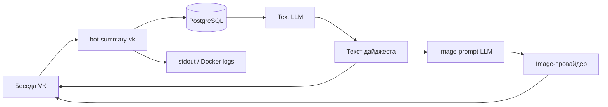

# Конфиденциальность и обработка данных

Этот документ описывает фактическое движение и хранение данных в
`bot-summary-vk`. Проект поставляется как программное обеспечение для
самостоятельного развертывания: автор проекта не получает доступ к данным
конкретной установки автоматически. За настройки, выбранных провайдеров,
доступ к базе и соблюдение применимых правил отвечает оператор установки.

## Кратко

Бот получает сообщения беседы ВКонтакте, сохраняет их в PostgreSQL и при
подготовке дайджеста передает часть накопленного контекста настроенному
LLM-провайдеру. Если включены изображения, текст готового дайджеста сначала
используется для создания визуального prompt, после чего этот prompt
отправляется image-провайдеру.



До добавления сообщества оператору следует уведомить участников беседы о том,
что их сообщения будут обрабатываться ботом и внешними сервисами. Если такой
порядок неприемлем для участников, бота не следует добавлять в беседу.

## Какие данные сохраняются в PostgreSQL

### Необработанные сообщения

В таблице `messages` сохраняются:

- внутренний номер записи, VK message ID и conversation message ID;
- идентификаторы беседы (`chat_id`, `peer_id`) и отправителя (`sender_id`);
- отображаемое имя отправителя и полный текст сообщения;
- время отправки и получения сообщения;
- признак исходящего сообщения;
- для ответа: идентификаторы, имя отправителя и текст исходного сообщения;
- технические даты создания и изменения записи.

Бот не загружает историю, которая была написана до его подключения и запуска:
в базу попадают события, полученные через Bots Long Poll во время работы.

### Опубликованные дайджесты и метрики

В `processed_summary_batches` сохраняются:

- идентификаторы беседы и диапазона обработанных сообщений;
- временные границы, количество исходных и осмысленных сообщений;
- полный текст опубликованного дайджеста и номер выпуска;
- способ запуска: автоматический или ручной;
- имена провайдеров и моделей text LLM, image-prompt LLM и image generator;
- количество input, cached input и output tokens;
- задержки text/image запросов и признак публикации изображения;
- даты создания и публикации.

Для каждой беседы хранится не более десяти последних опубликованных
дайджестов. Старые записи удаляются при успешном сохранении очередного выпуска.

### Служебное состояние

В `summary_chat_state` хранится порог следующей попытки автопубликации и время
последнего уведомления об ограничении. В `summary_issue_counters` хранится
следующий номер выпуска для каждого `peer_id`. В `schema_migrations` находятся
только имена примененных миграций.

Сгенерированные изображения не сохраняются приложением в PostgreSQL или на
диске: они обрабатываются в памяти и загружаются в VK. Копия опубликованного
изображения остается на стороне VK, а провайдер генерации может обрабатывать
или хранить запросы и результаты по собственным правилам.

## Что передается внешним сервисам

Фактический получатель определяется переменными `*_BASE_URL`, провайдером и
моделью. Оператор должен проверить условия обработки данных у выбранного
сервиса до запуска production-конфигурации.

### Text LLM: OpenAI, OpenRouter, Yandex, Cloudflare и совместимые API

При `LLM_PROVIDER=openai_compat` на адрес `LLM_BASE_URL` отправляются:

- системные инструкции для модели;
- имена и VK user ID авторов;
- время и полный текст выбранных текущих сообщений;
- имя и текст сообщения, на которое был дан ответ;
- временные границы и количество сообщений;
- до пяти предыдущих опубликованных дайджестов этой беседы;
- имя модели и параметры генерации.

Состав текущей подборки ограничивается настройками размера контекста, но любой
попавший в prompt фрагмент следует считать переданным внешнему провайдеру.
OpenRouter может дополнительно направлять запрос выбранному upstream-провайдеру
модели — это определяется настройками и правилами OpenRouter.

При `LLM_PROVIDER=stub` внешний LLM-запрос не выполняется.

### Подготовка prompt для изображения

Если изображения включены, image-prompt LLM получает системные инструкции и
до 2400 символов готового дайджеста. Исходный пакет сообщений этому отдельному
запросу напрямую не передается, однако дайджест может содержать имена,
пересказанные события и короткие цитаты из беседы.

Полученный визуальный prompt передается выбранному image-провайдеру:

- OpenAI Images;
- Cloudflare Workers AI;
- Yandex Art.

Image-провайдер не получает исходную переписку напрямую, но визуальный prompt
создан из дайджеста и может отражать чувствительные детали обсуждения.

### VK

VK является источником событий и получает обратно опубликованный дайджест,
служебные progress-сообщения, диагностические ответы и сгенерированное
изображение. Срок хранения этих данных определяется настройками беседы и
правилами VK, а не PostgreSQL приложения.

## Срок хранения и момент удаления

В приложении нет настраиваемого общего TTL.

- Необработанные сообщения хранятся до успешной публикации соответствующего
  дайджеста и фиксации выпуска в PostgreSQL.
- После успешной публикации в VK приложение в одной транзакции сохраняет
  выпуск и удаляет исходные сообщения до конца обработанного диапазона.
- Если сообщений недостаточно, LLM или VK недоступны либо сохранение выпуска
  завершилось ошибкой, исходные сообщения остаются для повторной попытки.
- В малоактивной беседе сообщения поэтому могут храниться неограниченно долго.
- Для каждой беседы сохраняются до десяти последних дайджестов вместе с
  метриками. Более старые удаляются только при сохранении нового выпуска.
- Состояние беседы и счетчик выпусков автоматически по сроку не удаляются.
- Правила хранения запросов у OpenAI, OpenRouter, Yandex, Cloudflare и других
  провайдеров определяются договорами, тарифом и настройками аккаунта оператора.

## Что попадает в логи

Приложение пишет JSON-логи в stdout. В Docker Compose они попадают в logging
driver Docker. Само приложение не задает срок хранения и ротацию логов.

Логи могут содержать:

- `peer_id`, `chat_id`, user ID и идентификаторы сообщений;
- длину и первые 80 символов входящего сообщения на уровне `INFO`;
- первые 320 символов подготовленного визуального prompt;
- провайдера, модель, счетчики tokens, задержки и количество сообщений;
- команды администратора и статусы выполнения;
- тексты ошибок VK, PostgreSQL и внешних провайдеров; ответ провайдера при
  ошибке может попасть в лог в сокращенном виде.

Полный text prompt и API-ключи намеренно не журналируются, но превью и ответы
об ошибках все равно могут содержать чувствительный текст. Доступ к Docker logs
следует ограничить, а ротацию и срок хранения — настроить на стороне Docker.
Для уменьшения объема превью можно использовать `LOG_LEVEL=WARN`, учитывая,
что предупреждения и ошибки внешних сервисов продолжат записываться.

## Ответственность и согласие участников

Оператор самостоятельно:

- выбирает LLM и image-провайдеров и принимает их условия;
- сообщает участникам, какие данные собираются и куда передаются;
- получает необходимое согласие участников, если оно требуется применимыми
  правилами, законодательством или договоренностями беседы;
- ограничивает доступ к `.env`, PostgreSQL, резервным копиям и логам;
- обрабатывает запросы участников на доступ или удаление данных;
- определяет допустимый срок хранения и выполняет очистку.

Факт публикации исходного кода не заменяет уведомление участников. Этот
документ описывает работу приложения и не является юридической консультацией.

## Как удалить данные

В боте нет пользовательской команды удаления. Очистку выполняет оператор
установки непосредственно в PostgreSQL. Перед удалением рекомендуется сделать
резервную копию, если ее хранение допустимо, и остановить приложение, чтобы
новые события не записывались одновременно с очисткой.

### Удаление одной беседы

1. Остановить приложение:

   ```bash
   docker compose stop app
   ```

2. Открыть `psql` внутри контейнера PostgreSQL:

   ```bash
   docker compose exec postgres sh -lc 'psql -U "$POSTGRES_USER" -d "$POSTGRES_DB"'
   ```

3. При необходимости найти `peer_id` по сохраненным данным:

   ```sql
   SELECT peer_id, chat_id, COUNT(*) AS messages
   FROM messages
   GROUP BY peer_id, chat_id
   ORDER BY peer_id;
   ```

4. Удалить все данные беседы, заменив `2000000001` на нужный `peer_id`:

   ```sql
   BEGIN;
   DELETE FROM messages WHERE peer_id = 2000000001;
   DELETE FROM processed_summary_batches WHERE peer_id = 2000000001;
   DELETE FROM summary_chat_state WHERE peer_id = 2000000001;
   DELETE FROM summary_issue_counters WHERE peer_id = 2000000001;
   COMMIT;
   ```

5. Выйти из `psql` командой `\q` и снова запустить приложение:

   ```bash
   docker compose start app
   ```

После удаления счетчик выпусков этой беседы начнется заново. Удаление записей
PostgreSQL не удаляет уже опубликованные сообщения и изображения из VK.

### Удаление всех пользовательских данных

После остановки приложения выполнить в `psql`:

```sql
BEGIN;
TRUNCATE TABLE
    messages,
    processed_summary_batches,
    summary_chat_state,
    summary_issue_counters
RESTART IDENTITY;
COMMIT;
```

Таблицу `schema_migrations` удалять не нужно: она не содержит пользовательских
данных и необходима для корректного запуска приложения.

Отдельно проверьте и при необходимости удалите:

- Docker logs и старые контейнеры;
- резервные копии и снимки volume PostgreSQL;
- опубликованные дайджесты и изображения в VK;
- данные в кабинетах внешних провайдеров, если они поддерживают такую очистку.

Для вопросов о конкретной установке участнику следует обращаться к ее
оператору. По вопросам работы проекта можно связаться с автором через
[VK](https://vk.com/haeniken) или [Telegram](https://t.me/haeniken).
